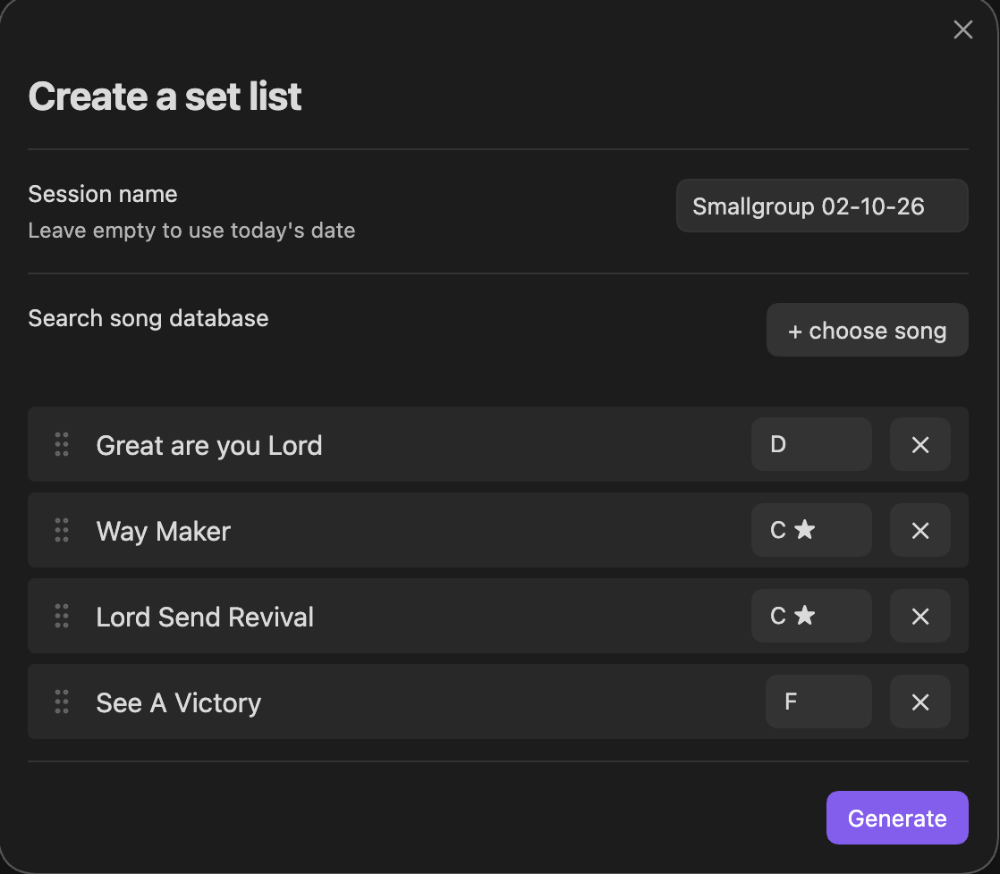

# Music Session PDFs

An Obsidian plugin to manage a worship song database and generate ready-to-use PDFs for a session: a lyrics PDF for participants and a merged sheet-music PDF (in the chosen key per song) for the leader's tablet.

Works on both desktop and mobile.

## How it works

Your song database lives directly in your Obsidian vault as regular notes. This plugin reads that data to let you build a setlist, save it as a session note, and generate PDFs from it.

### Song notes

Each song is a single Markdown file with frontmatter and lyrics combined:

```yaml
---
preferred key: C
language: DE
level: 01 kann ich
tags:
  - "#worship"
sheet:
  - "[[Song Name.pdf|Chord Numbers]]"
  - "[[Song Name-chords-G.pdf|Chords G]]"
---
[Verse 1]
...
```

- `preferred key` — the key you'd default to when adding the song to a setlist.
- `sheet` — a list of wikilinks to PDF files, each with an alias:
  - `Chords <Key>` (e.g. `Chords G`) is treated as a key-specific sheet.
  - Any other alias (e.g. `Chord Numbers`) is treated as key-independent and used as a fallback when no exact key match exists.

### Folders

Three folders hold your data, all configurable in **Settings → Music Session PDFs**:

| Setting | Default | Contents |
|---|---|---|
| Lyrics folder | `Lyrics` | One note per song (frontmatter + lyrics) |
| Sheets folder | `Sheets` | Sheet-music PDFs referenced from song notes |
| Sessions folder | `Sessions` | Generated session notes; PDFs go in a `PDFs` subfolder |

Folders are created automatically on plugin load if missing.

## Usage

1. Click the ribbon icon (or run **Create set list** from the command palette) to open the setlist builder.


3. Click **Generate** to save a session note.
4. Right-click the session note in the file explorer:
   - **Generate lyrics PDF** — one page per song, sized for reading on a phone.
   - **Generate sheet PDF** — merges the original sheet-music PDFs for each song's chosen key (falling back to "Chord Numbers" if the exact key isn't available; songs with no sheet at all are skipped with a notice, the rest of the PDF is still generated).
   - **Edit music session** - edit songs and key from a existing setlist
     

Both generated PDFs are saved to `Sessions/PDFs/` and linked back into the session note's frontmatter (`lyrics_pdf`, `sheet_pdf`).

### Session notes

A generated session note looks like:

```markdown
---
date: 2026-08-01
generated: true
lyrics_pdf: "[[Sessions/PDFs/Session 2026-08-01 - Lyrics.pdf]]"
sheet_pdf: "[[Sessions/PDFs/Session 2026-08-01 - Sheets.pdf]]"
---

> [!warning] This file is auto-generated. Do not edit — changes will be lost on regeneration.

- [[Great are you Lord]] key: D sheet: [[Sheets/Great are you Lord.pdf]]
- [[Way Maker]] key: C sheet: [[Sheets/Way Maker-chords-C.pdf]]
```

The resolved sheet per song is frozen at generation time — regenerating the setlist re-resolves it, but editing the song database afterward won't silently change a past session.

## Installation (mobile + desktop)

This plugin isn't published to the Community Plugin store, so install it via [BRAT](https://github.com/TfTHacker/obsidian42-brat) (works identically on desktop and mobile):

1. Install **BRAT** from the Community Plugins store.
2. In BRAT, choose **Add Beta Plugin** and enter this repository.
3. BRAT installs the latest GitHub release and can auto-update on future releases.

## Known limitations

- Sheet-music PDFs are merged as-is (original pages copied); the plugin does not transpose chords.
